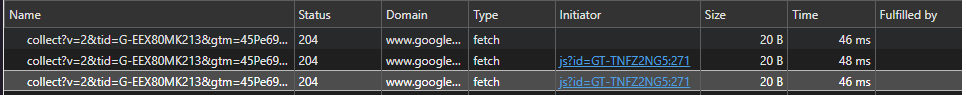
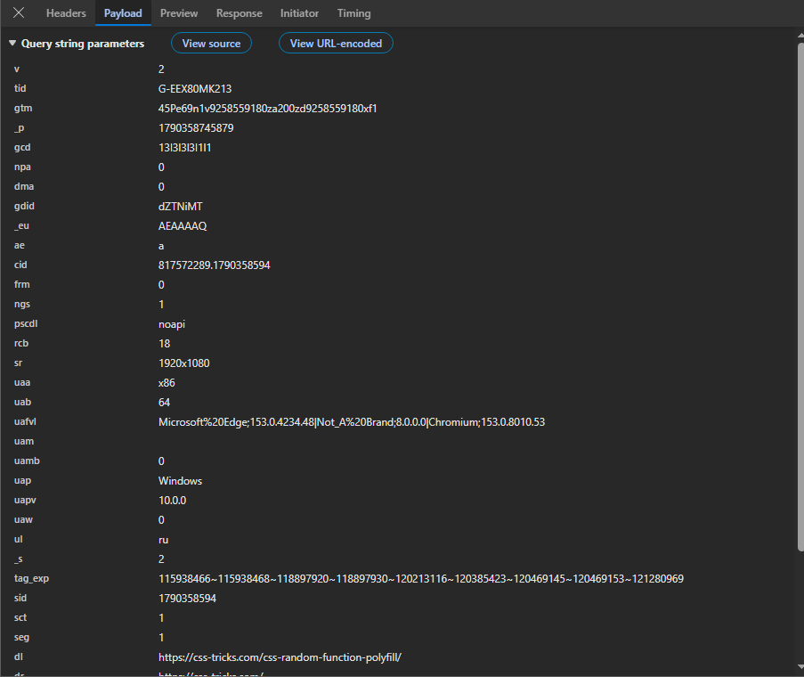

# Домашняя работа № 1 · Путь данных от ссылки до заявки

**Дисциплина:** ОП.03 «Информационные технологии»

| Поле | Значение |
|---|---|
| Фамилия, имя, отчество | Зотов Владислав Сергеевич |
| Группа | РПО 25/9/3 |
| Номер работы | 1 |
| Тема работы | Цифровая воронка: путь данных от ссылки до заявки |
| Дата сдачи | 25.09.26 |
| Ветка | `hw-01` |

---

## Задание

1. Открыть сайт, панель разработчика (F12) → **Network**, в фильтре `collect`,
   галочка **Preserve log**.
2. Сделать три действия: обновить страницу, прокрутить до низа, нажать
   на товар. Записать, какие события ушли - параметр `en` на вкладке **Payload**.
3. Описать путь пользователя от ссылки до заявки, пять шагов.
4. Найти одно место на этом пути, где данные могут потеряться.
5. Приложить скриншоты `screens/01-network.png` и `screens/02-payload.png`.

Сайт: https://shop.merch.google/, запасные - https://habr.com/ru/,
https://www.smashingmagazine.com/, https://css-tricks.com/. Открывать
в Chrome или Edge с выключенным блокировщиком рекламы.

Срок - до начала занятия 2. Ветка `hw-01`, запрос на слияние в свою `main`.

---

## 1. Какой сайт смотрел

| Поле | Значение |
|---|---|
| Название сайта | css-tricks |
| Адрес | https://css-tricks.com/ |
| Откуда сайт | из списка в задании |

## 2. Три действия и что отправил счётчик

Панель Network, фильтр `collect`, галочка Preserve log. Название события
лежит в параметре `en` на вкладке Payload.

В первой строке стоит пример. **Удалите его** и впишите свои три.

| № | Что я сделал на сайте | Название события (`en`) | Что ещё было в Payload |
|---|---|---|---|
| 1 | обновил страницу | page_view | dr - ресурс, откуда пришел |
| 2 | прокрутил до низа | scroll | tid - уникальный идентификатор счётчика Google Analytics |
| 3 | нажал на товар (или на ссылку) | page_view | uap - информация об операционной системе устройства, с которого вы зашли на сайт |

Скриншоты:

## 3. Путь пользователя: 5 шагов

От ссылки до заявки, своими словами. Панель для этого не нужна: это рассказ
о том, как человек доходит до кнопки «Отправить». В правом столбце стоит
пример, в левом вы пишете свой вариант.

| № | Мой шаг | Пример |
|---|---|---|
| 1 | пользователь перешел по ссылке из рекламы | *человек увидел ссылку в сообществе и нажал на неё* |
| 2 | посмотрел описание и фотографии товара | *открылась главная страница сайта* |
| 3 | выбрал нужный размер и добавил вещь в корзину | *он прокрутил до формы записи* |
| 4 | перешел к оформлению и вписал адрес доставки | *начал заполнять: имя и телефон* |
| 5 | подтвердил заказ, и данные ушли продавцу | *нажал «Отправить», заявка ушла менеджеру* |

## 4. Где данные могут потеряться

В первой строке стоит пример, **удалите его**. Строку 1 заполняют все,
строку 2 заполняйте по желанию.

| № | На каком шаге | Что может потеряться |
|---|---|---|
| 1 | 1 - переход по ссылке | метки рекламы стерлись при редиректе, поэтому система аналитики не поймет, из какой именно рекламной кампании пришел клиент |
| 2 | 3 - добавление в корзину | человек зашел с телефона и отвлекся на звонок, сессия оборвалась, из-за чего дальнейшие действия запишутся как совершенно новый визит |
| 3 | 5 - подтверждение заказа | во время оплаты пропал интернет: магазин получил заказ, но скрипт аналитики не успел отправить событие об успешной покупке |

## 5. Использование ИИ

| Вопрос | Ответ |
|---|---|
| Что сделал сам | Самостоятельно зашел на сайт с выключенным блокировщиком, открыл панель Network, нашел отправленные события по фильтру collect, изучил вкладку Payload и сделал необходимые скриншоты. |
| Что спросил у модели | Уточнил точные формулировки параметров `tid` и `uap` |
| Что после этого изменил | Записал понятную расшифровку параметров в таблицу |
