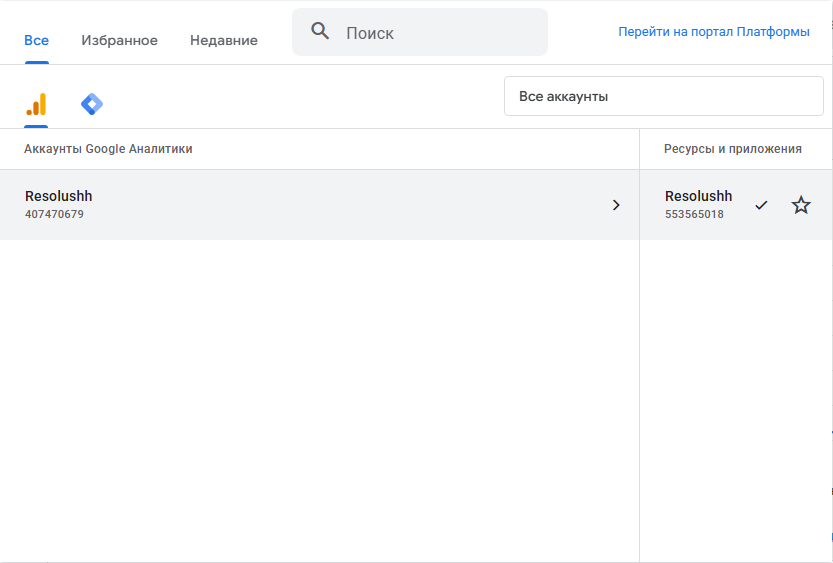
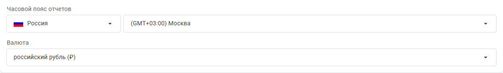
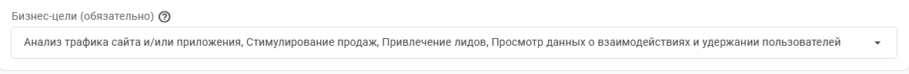
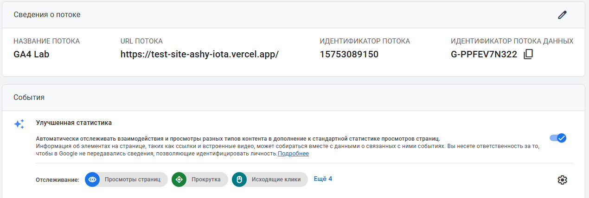
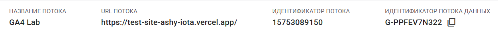

# Домашняя работа № 2 · Где бизнес теряет клиентов

**Дисциплина:** ОП.03 «Информационные технологии»

| Поле | Значение |
|---|---|
| Фамилия, имя, отчество | Зотов Владислав Сергеевич |
| Группа | 25/9/3 |
| Номер работы | 2 |
| Тема работы | Анализ воронки цифрового продукта и структура Google Analytics 4 |
| Дата сдачи | 25.09.26 |
| Ветка | `hw-02` |

---

# Часть 1. Исследование воронки

## 1.1. Объект исследования

| Поле | Значение |
|---|---|
| Компания, сервис или отрасль | Додо Пицца (доставка еды) |
| Адрес сайта или приложения | https://dodopizza.ru/ |
| Целевое действие | Оформление и оплата заказа |
| Почему выбран этот объект | Массовый сервис с классической воронкой продаж и частыми сценариями брошенной корзины. |

## 1.2. Воронка

От 4 до 7 этапов, по порядку.

| № | Этап | Что считается переходом дальше | Метрика этапа |
|---|---|---|---|
| 1 | Меню | Клик на карточку пиццы | % перехода в товар |
| 2 | Карточка товара | Нажатие «Добавить в корзину» | Конверсия в добавление |
| 3 | Корзина | Нажатие «К оформлению» | % перехода к чекауту |
| 4 | Оформление | Ввод адреса и времени доставки | % заполнения формы |
| 5 | Оплата | Успешный платеж | Финальная конверсия |

## 1.3. Источники

Не менее пяти. Каждый разбирается по пяти пунктам.

### Источник 1

### Источник 1

| Поле | Значение |
|---|---|
| Название материала | Сравнение сервисов для автодополнения адресов в форме |
| Автор или организация | Хабр |
| Дата публикации | 2014 |
| Прямая ссылка | https://habr.com/ru/articles/214945/ |

**Выписка из материала** (ключевая мысль, цифра, наблюдение, результат):

> Автодополнение адреса в одну строку сильно упрощает пользователю заполнение формы доставки.

**Что подтверждает и как связано с моей воронкой** (своими словами):

> Для 4 этапа (Оформление). Подсказки при вводе адреса экономят время клиента и снижают риск того, что он бросит заказ из-за неудобной формы.

**Цифры из источника и этап воронки, к которому относятся:**

> Коммерческих метрик в статье нет, упоминается только технический лимит - от 1000 запросов к API в сутки (Этап 4: Оформление).

### Источник 2

| Поле | Значение |
|---|---|
| Название материала | Самый подробный гайд по тактике «Брошенная корзина» |
| Автор или организация | emailmatrix / vc.ru |
| Дата публикации | 29 января 2021 |
| Прямая ссылка | https://vc.ru/marketing/201902-samyi-podrobnyi-gaid-po-taktike-broshennaya-korzina |

**Выписка из материала:**

> Триггерные письма автоматически уходят тем, кто собрал корзину, но не оплатил, чтобы мотивировать их завершить заказ.

**Что подтверждает и как связано с моей воронкой:**

> Касается 3 этапа (Корзина). Если клиент отвлекся, своевременное напоминание поможет вернуть его сразу к чекауту.

**Цифры из источника и этап воронки:**

> 69,57% отказов при оформлении, 8,6% конверсия из писем-напоминаний (Этап 3: Корзина).

### Источник 3

| Поле | Значение |
|---|---|
| Название материала | СБП для бизнеса: всё о системе быстрых платежей |
| Автор или организация | ЮKassa |
| Дата публикации | 27 июня 2023 |
| Прямая ссылка | https://yookassa.ru/recipes/start-biznesa/vse-o-sisteme-bystryh-platezhej-dlya-biznesa/ |

**Выписка из материала:**

> Оплата по QR-коду через банковское приложение проходит моментально и без ввода реквизитов карты.

**Что подтверждает и как связано с моей воронкой:**

> Обосновывает важность 5 этапа (Оплата). СБП заменяет долгий ручной ввод номера карты на оплату в один клик, спасая спонтанные покупки.

**Цифры из источника и этап воронки:**

> Оплата проходит мгновенно. Для бизнеса это выгоднее эквайринга: комиссия составляет от 0,2% до 0,7%, а лимит одного платежа - до 1 млн рублей (Этап 5: Оплата).

### Источник 4

| Поле | Значение |
|---|---|
| Название материала | ТОП способов вернуть покупателя к брошенной корзине |
| Автор или организация | Хабр |
| Дата публикации | 22 ноября 2024 |
| Прямая ссылка | https://habr.com/ru/articles/860652/ |

**Выписка из материала:**

> 28% покупателей бросают заказ из-за принудительной регистрации перед оформлением.

**Что подтверждает и как связано с моей воронкой:**

> Доказывает, что на 4 этапе (Оформление) обязательная регистрация работает как барьер - клиенту проще уйти, чем создавать аккаунт.

**Цифры из источника и этап воронки:**

> 28% отказов из-за принудительной регистрации и 21% отказов из-за долгого чекаута (Этап 4: Оформление).

### Источник 5

| Поле | Значение |
|---|---|
| Название материала | От брошенных корзин к покупкам: как увеличить конверсии |
| Автор или организация | vc.ru |
| Дата публикации | 29 мая 2025 |
| Прямая ссылка | https://vc.ru/seo/2015356-kak-umenshit-broshennye-korziny-i-povysit-konversii-v-internet-magazine |

**Выписка из материала:**

> Доля брошенных корзин в e-commerce постоянно растет и в 2024 году достигла 70,1%. 

**Что подтверждает и как связано с моей воронкой:**

> Подтверждает, что 3 этап (Корзина) - самое слабое место воронки продаж, где теряется большая часть потенциальных клиентов.

**Цифры из источника и этап воронки:**

> 70,1% - средняя доля брошенных корзин (Этап 3: Корзина).

## 1.4. Реальные кейсы

Не менее двух, российские компании или российский рынок. Каждый разбирается по семи
пунктам. Если показатели не опубликованы, пишется: «точные показатели
в открытом источнике не приведены».

### Кейс 1

| № | Пункт | Ответ |
|---|---|---|
| 1 | Компания, продукт или рынок | Небольшой интернет-магазин (из статьи на Хабре) |
| 2 | Как выглядела воронка или её проблемный участок | Ввод адреса доставки (Этап 4) |
| 3 | В чём заключалась проблема | Требовалось реализовать удобное автодополнение адреса одной строкой (только для Москвы), чтобы избавить пользователей от ручного заполнения полей. |
| 4 | Какие данные или наблюдения подтвердили проблему | Тестирование показало, что Google Maps предлагает нерелевантные варианты (выдает «Москва, Россия» вместо улицы), а отечественный КЛАДР не поддерживает поиск всего адреса одной строкой. |
| 5 | Что изменили или протестировали | Внедрили подсказки от DaData, программно подставляя слово «Москва» перед запросом пользователя. |
| 6 | Как изменился результат | Получили рабочее автодополнение: при вводе первых букв улицы система сразу предлагает верные номера домов и индексы, укладываясь в лимит 1000 бесплатных запросов. |
| 7 | Переносим ли подход на мой объект | Да, ввод адреса в одну строку без разбивки на поля «город/улица/дом» - стандарт для чекаута доставки еды. |

**Ссылка на источник кейса:**
> https://habr.com/ru/articles/214945/

>

### Кейс 2

| № | Пункт | Ответ |
|---|---|---|
| 1 | Компания, продукт или рынок | Lamoda / Российский e-commerce |
| 2 | Как выглядела воронка или её проблемный участок | Брошенная корзина (Этап 3) |
| 3 | В чём заключалась проблема | Клиенты добавляли товары в корзину, но отвлекались или уходили из-за сомнений, не завершая оформление заказа. |
| 4 | Какие данные или наблюдения подтвердили проблему | Отраслевая статистика показывает, что в среднем 69,57% посетителей сайтов не завершают оформление заказа. |
| 5 | Что изменили или протестировали | Настроили триггерную цепочку из трех писем: 1. Напоминание о забытых товарах. 2. Создание срочности (товары заканчиваются). 3. Спецпредложение (промокод на скидку 10% на 3 дня). |
| 6 | Как изменился результат | По статистике Barilliance (приведенной в тексте), средняя открываемость таких писем достигает 43,3%, а итоговая конверсия в покупку составляет 8,6%. |
| 7 | Переносим ли подход на мой объект | Да, автоматические напоминания (push или email) с сохраненным заказом отлично возвращают клиента в воронку. |

**Ссылка на источник кейса:**
> https://vc.ru/marketing/201902-samyi-podrobnyi-gaid-po-taktike-broshennaya-korzina

>

## 1.5. Причины потери пользователей

Не менее трёх. Каждая опирается на найденные материалы.

| № | Этап воронки | Причина потери | Какой источник это подтверждает |
|---|---|---|---|
| 1 | 3 (Корзина) | Пользователи отвлекаются или сомневаются, бросая уже собранный заказ (отваливается около 70% клиентов). | Источник 5 и Источник 2 |
| 2 | 4 (Оформление) | Обязательная регистрация учетной записи и долгий ручной ввод полного адреса доставки. | Источник 4 и Источник 1 |
| 3 | 5 (Оплата) | Необходимость вручную вбивать номер банковской карты, если её нет под рукой. | Источник 3 |

## 1.6. Гипотезы улучшения

Не менее трёх, собственные.

| № | Этап | Гипотеза | Какие данные нужно собрать | Как проверить, сработало |
|---|---|---|---|---|
| 1 | 3 (Корзина) | Если отправлять автоматический push или email через 30 минут после ухода с сайта, часть клиентов вернется и оплатит пиццу. | % открытий напоминаний, % вернувшихся в корзину, финальная конверсия. | Запустить A/B-тест: половине бросивших слать уведомление, половине - нет. Сравнить конверсию в покупку. |
| 2 | 4 (Оформление) | Если сделать автодополнение адреса одной строкой и гостевой чекаут без пароля, время оформления заказа резко сократится. | Среднее время нахождения на странице оформления, % отказов на 4 этапе. | Замерить время заполнения формы и долю переходов к оплате до внедрения фичи и после. |
| 3 | 5 (Оплата) | Если сделать кнопку СБП основным и самым заметным способом оплаты, отказов на последнем шаге станет меньше. | Доля успешных транзакций, количество отмененных заказов на этапе кассы. | Сравнить общую конверсию 5 этапа до вывода СБП на первый план и через месяц после. |
---

# Часть 2. Google Analytics 4

## 2.1. Пройденные шаги

| № | Шаг | Выполнено |
|---|---|---|
| 1 | Вход в Google Analytics под своим аккаунтом | да |
| 2 | Создан Analytics Account | да |
| 3 | Создан Property | да / нет |
| 4 | Выбраны часовой пояс, валюта и общие сведения | да |
| 5 | Выбраны бизнес-цели | да |
| 6 | Создан ресурс | да |
| 7 | Создан Web Data Stream | да |
| 8 | Проверены Website URL, Stream name, Enhanced Measurement | да |
| 9 | Поток создан | да |
| 10 | Найден Measurement ID | да |

## 2.2. Что получилось

| Поле | Значение |
|---|---|
| Analytics Account | Resolushh |
| Property | GA4 Lab |
| Reporting time zone | GMT+03:00 |
| Currency | Российский рубль (RUB) |
| Выбранные бизнес-цели | Анализ трафика сайта и/или приложения, Стимулирование продаж, Привлечение лидов, Просмотр данных о взаимодействиях и удержании пользователей |
| Stream name | GA4 Lab |
| Website URL | https://test-site-ashy-iota.vercel.app/ |
| Stream ID (числовой) | 15753089150 |
| Measurement ID (`G-…`) | G-PPFEV7N322 |
| Enhanced Measurement | включено |

Stream ID и Measurement ID - это разные идентификаторы. На сайт в задании 3
ставится второй, вида `G-XXXXXXXXXX`.

## 2.3. Скриншоты

Скриншот: 

Скриншот: 

Скриншот: 

Скриншот: 

Скриншот: 

---

## Использование ИИ

Источники вы ищете, читаете и проверяете сами, настройку проходите тоже
сами. ИИ допускается для поиска идей, структурирования и проверки
формулировок, но источником он не считается.

| Вопрос | Ответ |
|---|---|
| Что сделано самостоятельно | Выбран объект исследования (Додо Пицца), найдены и изучены все 5 источников, разобраны кейсы, вручную пройдена настройка счетчика GA4 и сделаны скриншоты. |
| Что спрошено у модели | Помощь с оформлением Markdown-таблиц, первичная структурировка текста и вычитка гипотез на лаконичность. |
| Что после этого проверено и изменено | Лично перепроверены все ссылки и цифры в статьях, гипотезы скорректированы под реальные проблемы интерфейса, вписаны актуальные данные из моего аккаунта GA4. |
