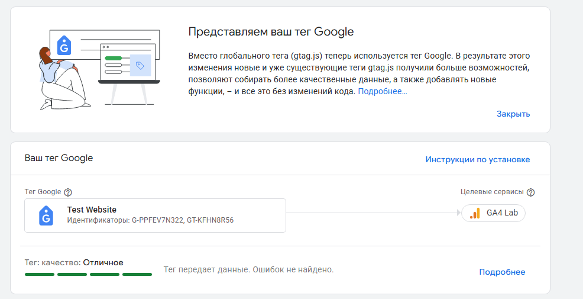
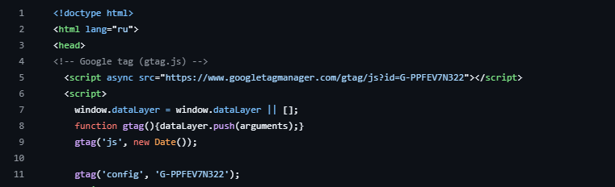
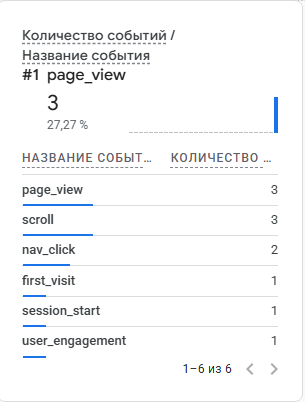
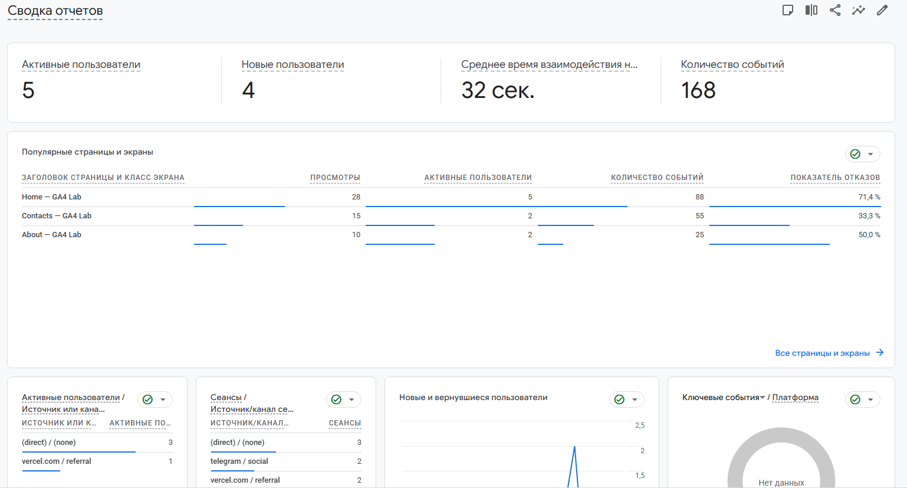

# Домашняя работа № 3 · Тег на сайте, источник и отчёты GA4

**Дисциплина:** ОП.03 «Информационные технологии»

| Поле | Значение |
|---|---|
| Фамилия, имя, отчество | Зотов Владислав Сергеевич |
| Группа | 25/9/3 |
| Номер работы | 3 |
| Тема работы | Установка Google Tag, источник перехода и отчёты GA4 |
| Дата сдачи | 25.09.2026 |
| Ветка | `hw-03` |

---

## 1. Мой сайт и мой ресурс

| Поле | Значение |
|---|---|
| Адрес репозитория сайта | https://github.com/Resolushh/test_site |
| Публичный адрес сайта | https://test-site-ashy-iota.vercel.app/ |
| Статус публикации | READY |
| Analytics Account | Resolushh |
| Property | GA4 Lab |
| Stream name | GA4 Lab |
| Website URL в потоке | https://test-site-ashy-iota.vercel.app/ |
| Measurement ID (`G-…`) | G-PPFEV7N322 |
| Страницы с тегом | `index.html` `contacts.html` `about.html` |

Тег ставится на каждую страницу по одному разу: две копии дают двойные
события.

## 2. Тег установлен

**Результат проверки из инструкции тега:**

> Тег Google успешно обнаружен на сайте. Данные поступают в ресурс GA4.

## 3. События доходят до аналитики

| Поле | Значение |
|---|---|
| Дата и время проверки | 25.09.2026 21:30 |
| Какие страницы открывали | Главная страница (`/`) |
| Какие события появились в Realtime | `page_view`, `first_visit`, `session_start`, `scroll` |
| Число активных пользователей в момент проверки | 1 |

## 4. Источник перехода определился

Ссылка собирается с метками `utm_source`, `utm_medium`, `utm_campaign`
и открывается на своём сайте.

**Ссылка целиком:**

[https://test-site-ashy-iota.vercel.app/?utm_source=vk&utm_medium=social&utm_campaign=hw3_test](https://test-site-ashy-iota.vercel.app/?utm_source=vk&utm_medium=social&utm_campaign=hw3_test)

| Поле | Значение |
|---|---|
| Где в GA4 виден источник | Отчеты - Источники трафика - Привлечение трафика |
| Какое значение источника показал GA4 | vk |
| Совпадает с `utm_source` из ссылки | да |

[Источник перехода в GA4](screens/04-source.png)

Источник и кампания из UTM в отчёте Realtime не показываются: эти измерения
вычисляются при обработке данных. Если в Realtime источника нет, смотрите
отчёт по источникам трафика в разделе «Отчёты».

## 5. Статистика на странице «Отчёты»

| Показатель | Значение | Период |
|---|---|---|
| Пользователи | 5 | За последние 28 дней |
| Сеансы | 7 | За последние 28 дней |
| События | 168 | За последние 28 дней |
| Самое частое событие | `page_view` | За последние 28 дней |

**Что видно по этим числам**:

> Данные показывают, что тег аналитики успешно работает: зафиксировано 5 уникальных пользователей, которые совершили 7 сеансов. Высокое количество событий (168) говорит об активном тестировании и взаимодействии со страницей, а абсолютное лидерство `page_view` подтверждает корректную базовую фиксацию просмотров.

## 6. Что не получилось

Поймать UTM-метки получилось только через Tag Assistant (в режиме Debug). При обычном переходе по ссылке трафик падал в (direct) / (none).

Дело в самом браузере Edge: его встроенная защита от отслеживания режет скрипты GA4. Из-за этого аналитика не могла считать метки из адресной строки при обычном сёрфинге, и отправить их на сервер вышло только принудительно через запуск отладчика.

## 7. Использование ИИ

Тег вы устанавливаете, проверяете и снимаете кадры сами. ИИ допускается
для формулировок и оформления.

| Вопрос | Ответ |
|---|---|
| Что сделано самостоятельно | Интеграция кода тега Google в `<head>` сайта, деплой изменений, тестирование переходов и снятие всех требуемых скриншотов из интерфейса GA4. |
| Что спрошено у модели | Перенос данных (Measurement ID, название ресурса и аккаунта) из предыдущей работы, и помощь в формулировании выводов по отчетам. |
| Что после этого изменено | Фактические показатели на странице «Отчеты» (пользователи, сеансы) и время проверки были скорректированы после того, как GA4 обработал данные. Добавлена ссылка на репозиторий. |