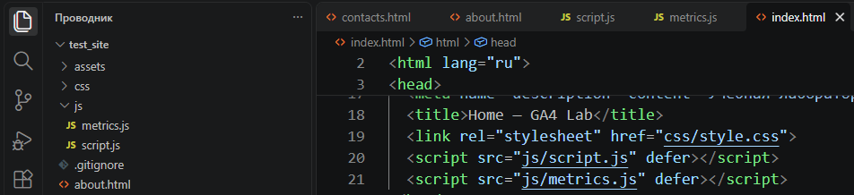
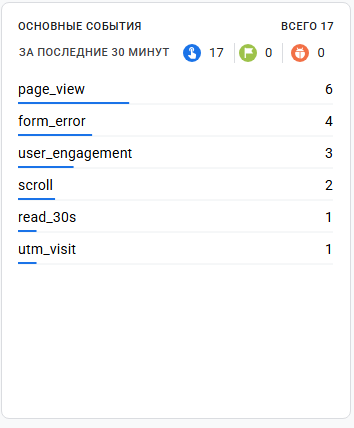
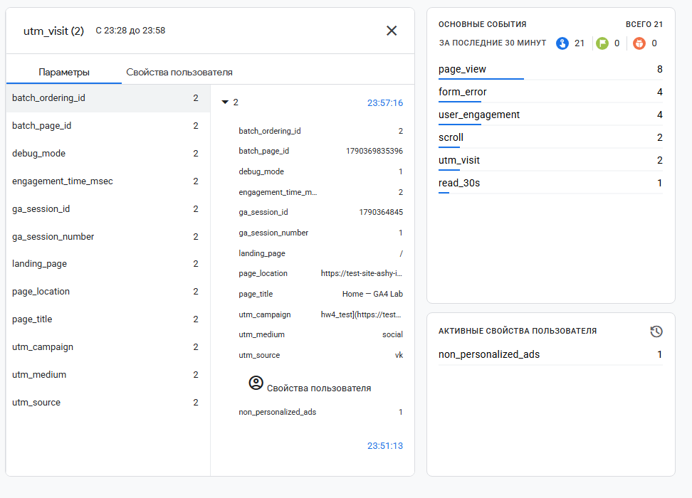
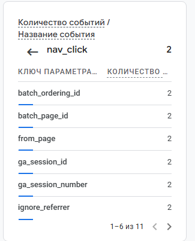

# Домашняя работа № 4 · Свои события и параметры в GA4

**Дисциплина:** ОП.03 «Информационные технологии»

| Поле | Значение |
|---|---|
| Фамилия, имя, отчество | Зотов Владислав Сергеевич |
| Группа | 25/9/3 |
| Номер работы | 4 |
| Тема работы | Свои события и параметры: четыре метрики на сайте |
| Дата сдачи | 25.09.2026 |
| Ветка | `hw-04` |

---

## 1. Мой сайт и мой ресурс

| Поле | Значение |
|---|---|
| Публичный адрес сайта | https://test-site-ashy-iota.vercel.app/ |
| Measurement ID (`G-…`) | G-PPFEV7N322 |
| Коммит с метриками (ссылка или первые 7 символов) | [https://github.com/Resolushh/test_site/commit/673d07040c58916c7bf038b8b123fbee11a72372](https://github.com/Resolushh/test_site/commit/673d07040c58916c7bf038b8b123fbee11a72372) |
| Статус публикации | READY |
| Страницы, где подключён `js/metrics.js` | `index.html` `contacts.html` `about.html` |

Файл подключается после основного скрипта и на каждой странице по одному
разу: два подключения дают двойные события.

## 2. Какие метрики добавлены

| Событие | Что измеряет | Что делали, чтобы оно сработало |
|---|---|---|
| `nav_click` | клики по пунктам меню | Кликали по ссылкам в навигационном меню сайта. |
| `utm_visit` | метки кампании из адреса | Переходили на сайт по ссылке с заданными UTM-метками. |
| `read_30s` | полминуты на странице | Оставляли вкладку с сайтом открытой и активной минимум 30 секунд. |
| `form_error` | форма не прошла проверку браузера | Пытались отправить форму с незаполненными обязательными полями или ошибками валидации. |



## 3. События в DebugView

| Поле | Значение |
|---|---|
| Дата и время проверки | 25.09.2026 22:45 |
| Как подключали отладку | Tag Assistant |
| Какие из четырёх событий пришли | `utm_visit`, `read_30s`, `form_error` |
| Какие не пришли и почему | Cобытия успешно зафиксированы, кроме `nav_click` |



## 4. Параметры события `utm_visit`

**Ссылка, по которой открывали сайт:**

```text
[https://test-site-ashy-iota.vercel.app/?utm_source=vk&utm_medium=social&utm_campaign=hw4_test](https://test-site-ashy-iota.vercel.app/?utm_source=vk&utm_medium=social&utm_campaign=hw4_test)

| Параметр | Значение в ссылке | Значение в GA4 |
|---|---|---|
| `utm_source` | vk | vk |
| `utm_medium` | social | social |
| `utm_campaign` | hw4_test | hw4_test |
| `landing_page` | — | / |



Если значение в GA4 отличается от значения в ссылке, напишите, в чём разница
и почему так вышло.

> Значение `landing_page` (страница входа) не задается в ссылке, а определяется автоматически самой системой аналитики при старте сессии, и в данном случае принимает значение пути `/` (главная страница). Остальные параметры полностью совпадают.

## 5. Событие вне отладки

| Поле | Значение |
|---|---|
| Где проверяли | Realtime |
| Какое событие искали | `nav_click` |
| Сколько срабатываний показал экран | 2 |
| Период (для отчёта) | Последние 30 минут |



## 6. Что эти метрики показывают про сайт

> Метрика `nav_click` позволяет понять, какие разделы меню наиболее востребованы у посетителей, а `read_30s` отсеивает случайные клики и показывает реальную вовлеченность в контент. Событие `form_error` помогает выявить проблемы с UX: если оно срабатывает слишком часто, значит, пользователям непонятно, как правильно заполнять поля контактной формы.

## 7. Что не получилось

> Сначала события не отображались в DebugView. Причина заключалась в строгой политике предотвращения отслеживания (Tracking prevention) браузера Microsoft Edge, блокировавшей отправку скриптов. Также событие `nav_click` терялось из-за моментального перехода на новую страницу (браузер прерывал скрипт). Проблема была решена отключением блокировки в Edge и открытием ссылок меню с зажатой клавишей Ctrl.

## 8. Использование ИИ

Скрипты метрик выданы готовыми. Подключение, проверку и кадры вы делаете
сами. ИИ допускается для формулировок и оформления.

| Вопрос | Ответ |
|---|---|
| Что сделано самостоятельно | Интеграция скрипта `js/metrics.js` на страницы сайта, деплой на Vercel, обход блокировок трекинга браузером, тестирование событий через Tag Assistant и сбор скриншотов из GA4. |
| Что спрошено у модели | Перенос данных проекта из прошлой работы, помощь с отладкой потери события `nav_click` в браузере. |
| Что после этого изменено | Добавлены фактические результаты тестирования в DebugView, скорректировано описание проблем с блокировщиком Edge для 7 пункта. Добавлена ссылка на коммит. |